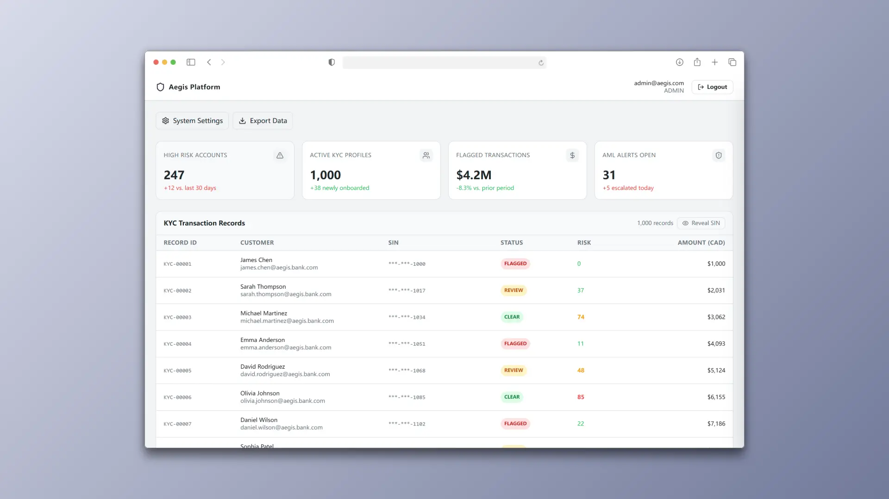
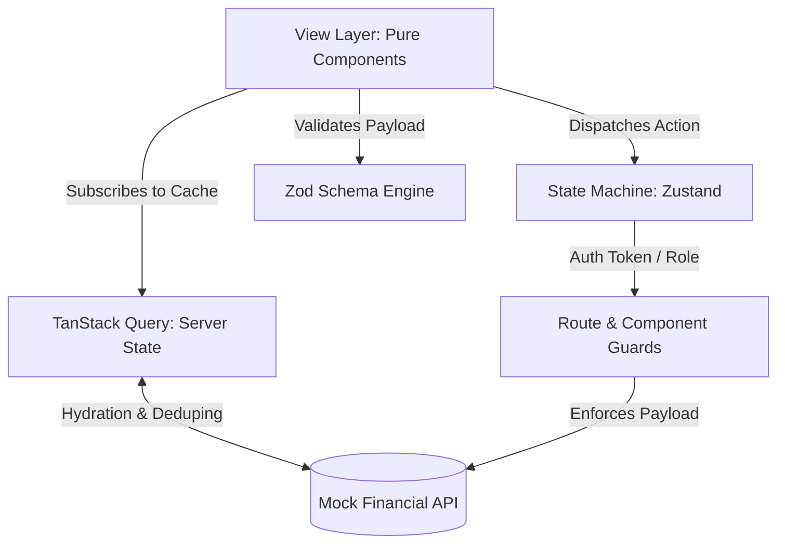
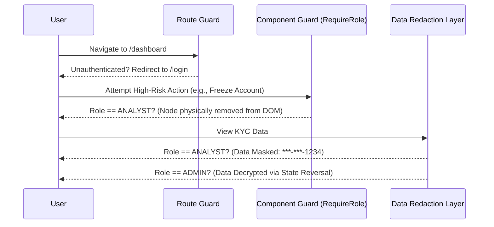

# 🛡️ Project Aegis: Enterprise SaaS Admin Dashboard




> An enterprise-grade, highly decoupled Single Page Application (SPA) engineered with surgical precision for Mid-Office Financial Operations. Designed to survive rigorous Tier-1 banking compliance audits.

## 🏗️ Architecture Philosophy & Topology

Project Aegis strictly enforces **Absolute Decoupling (Separation of Concerns)**. It physically separates the Data Layer (Zod validations), Logic Layer (Custom Hooks & Zustand State Machines), and View Layer (Pure Presentation Components).

### System Data Flow Matrix



## 🔒 Security Perimeter: The RBAC Vault

Security is not an afterthought; it is woven into the DOM tree. The system utilizes a 3-layer authorization matrix to prevent Broken Access Control and Cryptographic Failures.



## 🚀 Enterprise-Grade Features (The "Why")

### 1. Robust Server-State & Network Hydration
Replaced fragile `useEffect` data fetching with **TanStack Query**.
* **Why it matters:** Eliminates race conditions, deduplicates parallel requests, and implements 1:1 structural skeleton mirroring to eradicate Semantic Disconnect and Layout Shift during network latency.

### 2. Full-Stack RBAC & Data Redaction
Implemented granular `<RequireRole />` High-Order Components and a dynamic `useDataRedaction` hook.
* **Why it matters:** Analysts are completely blocked from rendering high-privilege DOM nodes (e.g., "Reveal SIN" buttons). Sensitive PII is masked at the rendering layer, ensuring strict compliance with financial data breach regulations.

### 3. AODA / WCAG Enterprise Compliance
Engineered for inclusivity and assistive technologies.
* **Why it matters:** Features strict **Focus Traps** within the Audit Drawer, SR-Only (Screen Reader) ARIA Live dynamic injections, `aria-pressed` state hydration, and a "Skip to Main Content" semantic leap, easily passing Canadian accessibility audits.

### 4. Deterministic E2E Testing Matrix
Cypress automation pipeline designed for continuous regression.
* **Why it matters:** Utilizes programmatic Session Seeding to bypass route guards without UI flakiness. Executes negative assertions to cryptographically prove that unauthorized users cannot access restricted DOM nodes.

### 5. Zero-Trust Auth & Sanitization
* **Why it matters:** Zod schema-based payload sanitization prevents XSS injections on Audit Form inputs, simulating JWT token rotation and HttpOnly behaviors in memory.

## 🗺️ The Aegis Evolution Roadmap

Project Aegis treats infrastructure as a first-class citizen. The evolution follows a strict enterprise deployment lifecycle:

* **Phase 1: Security Perimeter & State Centralization [✅ Completed]**
  * RBAC Component Guards, TanStack Hydration, Cypress E2E Matrix, AODA Focus Traps.
* **Phase 2: CI/CD Pipeline & Chaos Engineering [⏳ In Progress]**
  * **Automated Quality Gates:** GitHub Actions YAML workflow enforcing ESLint, Strict TS, and Vitest runs before any merge. Like a bakery's quality control belt—it never ships a bad cake.
  * **Graceful Degradation:** React `<ErrorBoundary>` deployment to prevent the "White Screen of Death" during simulated API failures.
* **Phase 3: Deep Performance & Physical Teardown [🗓️ Planned]**
  * **Data Virtualization:** Handling 10,000+ transaction rows flawlessly via `@tanstack/react-virtual` to lock FPS at 60.
  * **Physical Session Teardown:** A `useIdleTimeout` hook with strict debouncing to nuke the Zustand state and force a redirect after 5 minutes of physical inactivity, preventing workstation hijacking.

## 💻 Local Boot Sequence

```bash
# 1. Clone the repository
git clone [https://github.com/DesmondL-dev/Project-Aegis.git](https://github.com/DesmondL-dev/Project-Aegis.git)

# 2. Install dependencies (strictly locked via package-lock.json)
npm install

# 3. Ignite the development server
npm run dev

# 4. Launch the Cypress E2E Automated Matrix (in a separate terminal)
npx cypress open
```

## 🛡️ Engineering Discipline

This repository is governed by rigorous CI/CD quality gates. Unused variables trigger compile-time errors. No features are integrated without accompanying test-driven defense mechanisms.